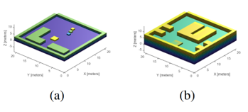
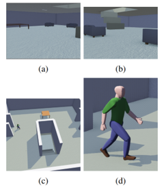
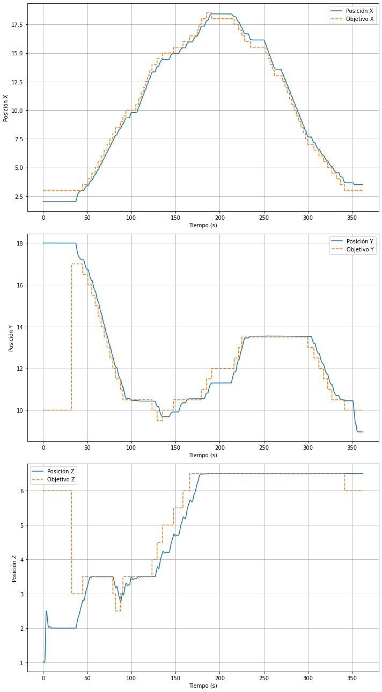
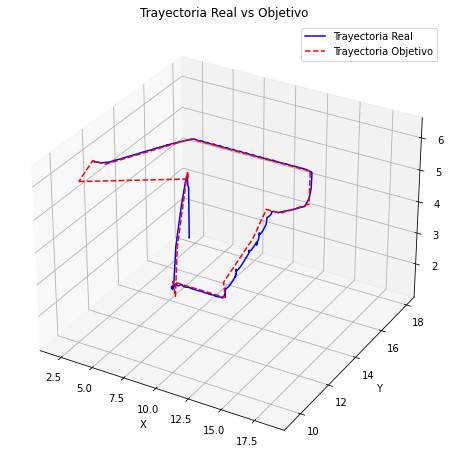

# Crazyflie Autonomous Navigation

This Python script controls a Crazyflie quadrotor in Webots simulator, generating a trajectory using the A* path planning algorithm and following it using PID control. Additionally, the script utilizes YOLO for real-time person recognition, causing the quadrotor to stop upon detection.

## Authors

- [@josemaese](https://github.com/JoseMaese)
- [@santiagomoreno0123](https://github.com/santiagomoreno0123)
- Miguel Ballesteros Delgado
- [@javgilavi](https://github.com/javgilavi)

## Dependencies

- `controller`, `Keyboard`, and `Supervisor` modules from Webots.
- PID controllers (`pid_velocity_fixed_height_controller` and `QuadrotorController`) for stability and navigation.
- Computer Vision functionalities with OpenCV (`cv2`) for person recognition using YOLO.
- Other libraries include `numpy`, `math`, `threading`, `csv`, `PIL`, `matplotlib`, and custom modules like `ruta_predefinida`, `evita_obstaculos`, `astar3D`, etc.

## Usage

1. Install Webots.
2. Place the script in the Webots project directory.
3. Run the Webots simulator with the specified Crazyflie model.

## Controls

- UP, DOWN, RIGHT, LEFT: Move in the horizontal plane.
- Q, E: Rotate around yaw.
- W, S: Go up and down.
- A: Enable autonomous mode.
- D: Disable autonomous mode.
- 1, 2, 3: Set predefined targets.
- I: Export data to CSV and generate graphs.

## Autonomous Mode

- The script generates a trajectory using the A* path planning algorithm and follows it autonomously.
- YOLO-based person recognition triggers a stop action.

## Vision System

- YOLO (You Only Look Once) is used for real-time person detection.
- Camera feed is processed to recognize and react to the presence of people.

## Additional Features

- Data logging: The script logs positional data and target information into CSV files for further analysis.

